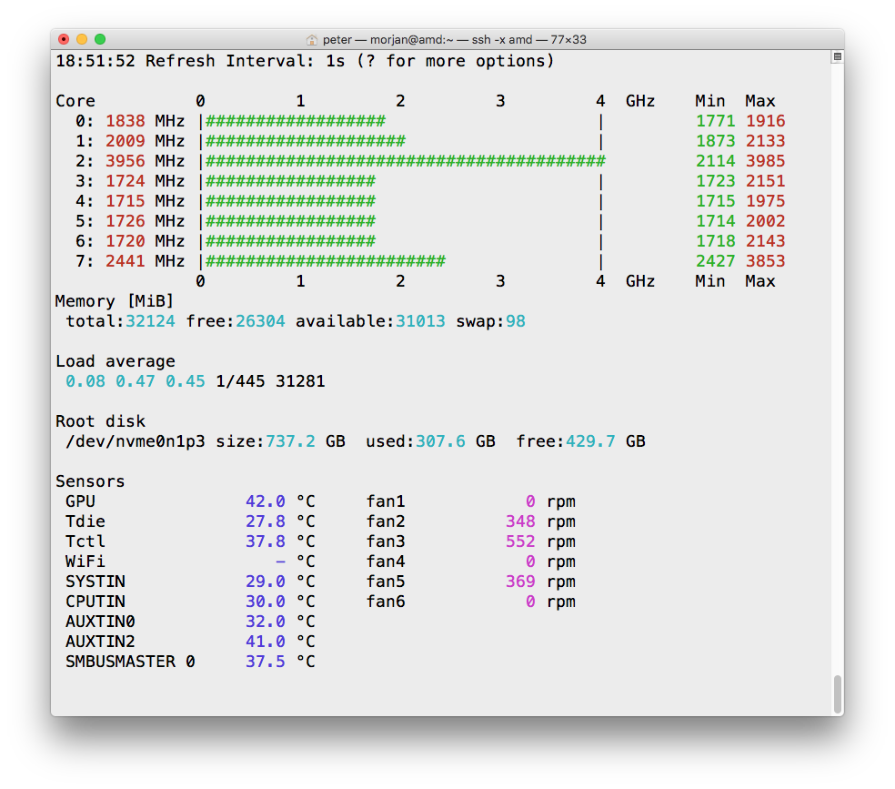

## monitor
A simple CPU frequency monitor for the Linux x86 terminal.

Get Go Compiler from https://golang.org/dl/
```
go build -ldflags "-s -w" -trimpath
./monitor
```



```
Special Keys:
  + : increase refresh interval
  - : decrease refresh interval
  d : toggle debug info
  c : run stress-ng cpu on one thread for 10 sec
  C : run stress-ng cpu on all threads for 10 sec
  m : run stress-ng matrix on one threads for 10 sec
  M : run stress-ng matrix on all threads for 10 sec
  r : reset min/max counters
  h : help
  q : quit
```
